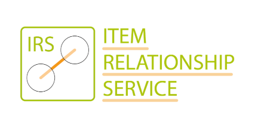

# 

[](https://github.com/catenax-ng/product-item-relationship-service/blob/main/LICENSE)  
[](https://github.com/catenax-ng/product-item-relationship-service/actions/workflows/irs-build.yml)
[](https://sonarcloud.io/summary/new_code?id=catenax-ng_product-item-relationship-service)
[](https://github.com/catenax-ng/product-item-relationship-service/actions/workflows/codeql.yml)  
[](https://github.com/catenax-ng/product-item-relationship-service/actions/workflows/kics.yml)
[](https://github.com/catenax-ng/product-item-relationship-service/actions/workflows/trivy.yml)
[](https://github.com/catenax-ng/product-item-relationship-service/actions/workflows/veracode.yaml)
[](https://github.com/catenax-ng/product-item-relationship-service/actions/workflows/owasp.yml)
[](https://github.com/catenax-ng/product-item-relationship-service/actions/workflows/spotbugs.yml)
[](https://github.com/catenax-ng/product-item-relationship-service/actions/workflows/eclipse-dash.yml)
[](https://github.com/catenax-ng/product-item-relationship-service/actions/workflows/xray-cucumber.yaml)
   

## What is the IRS?

Within the [Catena-X network](https://catena-x.net/), the so-called Item Relationship Service (IRS) forms an essential 
foundation for various services and products. Within the Catena-X use cases, the IRS serves to increase business value.
For example, the IRS provides functionalities to serve requirements, such as occasion-based Traceability, 
from the Supply Chain Act. In doing so, IDSA and Gaia-X principles, such as data interoperability and sovereignty, are 
maintained on the Catena-X network and access to dispersed data is enabled. Data chains are established as a common asset.

With the help of the IRS, data chains are to be provided ad-hoc across n-tiers within the Catena-X network. 
To realize these data chains, the IRS relies on data models of the Traceability use case and provides the federated 
data chains to customers or applications. Furthermore, the target picture of the IRS includes the enablement of new 
business areas by means of data chains along the value chain in the automotive industry.

## Usage

### Local deployment

The following subsection provides instructions for running the infrastructure on docker-compose and the application in the IDE.

#### Docker-compose + IDE

* Start the necessary infrastructure by running `docker-compose up`

* Start the application from your favorite IDE. For IntelliJ, a run configuration is available in the .run folder.

#### Local IRS API

- Swagger UI: http://localhost:8080/api/swagger-ui
- API docs: http://localhost:8080/api/api-docs
- API docs in yaml:  http://localhost:8080/api/api-docs.yaml

### Local Helm deployment

#### Prerequisites

- install rancher desktop
- install kubectl
- Credentials for external environments in [helm charts](charts/irs-environments/local/values.yaml) can be found in
  IRS-KeePass
  - registry.registry.dockerSecret
  - edc.vault.hashicorp.token _(for provider and consumer data- and control-plane)_
  - irs-helm.keycloak.oauth2.clientId
  - irs-helm.keycloak.oauth2.clientSecret
  - irs-helm.keycloak.oauth2.clientTokenUri
  - irs-helm.keycloak.oauth2.jwkSetUri

#### How to run

- **Windows**  
  In CMD or PowerShell execute from project root: `.\charts\irs-environments\local\start.bat`  
  A new window will open to forward the ports to your local machine.
  Do not close this window until you want to stop the local deployment

- **Linux**  
  Run the following commands from project root  
  `./charts/irs-environments/local/start.sh`  
  `./charts/irs-environments/local/forward-ports.sh`(in a separate terminal tab or window, this needs to stay open)  
  `./charts/irs-environments/local/upload-testdata.sh`

IRS will be available at http://localhost:10165

#### How to stop

`helm uninstall irs-local -n product-traceability-irs`

### Accessing the secured API

A valid access token is required to access every IRS endpoint and must be included in the Authorization header -
otherwise **HTTP 401 Unauthorized** status is returned to the client.

The IRS uses the configured Keycloak server to validate access tokens. By default, this is the Catena-X INT Keycloak
instance. Get in contact with them to receive your client credentials.

To obtain an access token, you can use the
prepared [Postman collection](./testing/IRS%20DEMO%20Collection.postman_collection.json).

### Sample calls

Start a job for a globalAssetId:

```bash
curl -X 'POST' \
  'http://localhost:8080/irs/jobs' \
  -H 'accept: application/json' \
  -H 'Content-Type: application/json' \
  -H 'Authorization: Bearer <token_value>' \
  -d '{
  "aspects": [
    "SerialPartTypization"
  ],
  "bomLifecycle": "asBuilt",
  "depth": 1,
  "direction": "downward",
  "globalAssetId": "urn:uuid:8a61c8db-561e-4db0-84ec-a693fc5ffdf6"
}'
```

Retrieve the job results by using the jobId returned by the previous call:
```bash
curl -X 'GET' 'http://localhost:8080/irs/jobs/<jobID>' -H 'accept: application/json' -H 'Authorization: Bearer <token_value>'
```

## Environments

### DEV environment

The latest version on main is automatically picked up by ArgoCD and deployed to the DEV environment.
See https://catenax-ng.github.io/.

http://irs.dev.demo.catena-x.net/api/swagger-ui/index.html?configUrl=/api/api-docs/swagger-config

Additionally, we supply our own EDC setup to be able to do end-to-end tests in an isolated environment.
This consists of:

- AAS Wrapper
- Digital Twin Registry
- EDC Consumer (Control and Data Plane, Postgres DB)
- EDC Provider (Control and Data Plane, Postgres DB)
- DAPS
- Multiple submodel servers to provide test data

This setup uses the docker images provided by [product-edc](https://github.com/catenax-ng/product-edc/)
, [product-DAPS](https://github.com/catenax-ng/product-DAPS) and Semantic Hub.

Check the Helm charts at [./charts](./charts) for the configuration.

The testdata on DEV is volatile and gets lost on pod restarts. New testdata can be provisioned using the GitHub action
trigger.

### INT environment

The latest version on main is automatically picked up by ArgoCD and deployed to the INT environment.
See https://catenax-ng.github.io/.

http://irs.int.demo.catena-x.net/api/swagger-ui/index.html?configUrl=/api/api-docs/swagger-config

Additionally, we supply our own EDC consumer to connect to the Catena-X integration system.
This consists of:
- AAS Wrapper
- EDC Consumer (Control and Data Plane, Postgres DB)

This setup uses the docker images provided by [product-edc](https://github.com/catenax-ng/product-edc/).

Check the Helm charts at [./charts/irs](./charts/irs) for the configuration. 

## Documentation

- [Item Relationship Service Documentation (catena-ng)](https://catenax-ng.github.io/product-item-relationship-service/docs/)

## Licenses

Apache 2.0 (https://www.apache.org/licenses/LICENSE-2.0) - see [LICENSE](./LICENSE)
